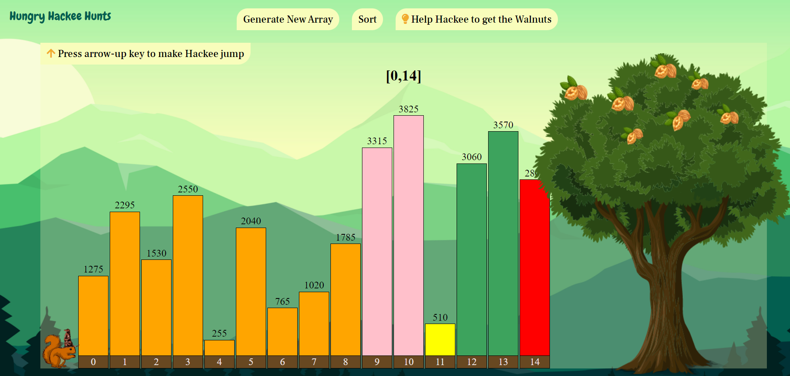

# Hungry Hackee Hunts

Help Hackee in her walnut heist while visualizing maze generator and different sorting algorithms.

## [Demo](https://www.yunikabajracharya.com.np/Hungry-Hackee-Hunts/)

## Game Idea
**Hackee**, a ground squirrel, wants to get the walnuts from a tree but cannot jump till there. There is a set of bars before the tree but they aren’t sorted so, she would first need to find a way to sort the bars.

There are two levels.

### Level 1 - Hackee in the A'maze'ng Land
- A maze is generated using recursive backtracking with Depth First Search.
- Hackee has to solve the maze in order to get the sorting hat.

### Level 2 - The Sorting Hat in action
- There are 15 unsorted bars in front of Hackee.
- Now that Hackee has got the sorting hat, she can sort the bars using any one of the sorting algorithms.
- Once the bars are sorted, Hackee can easily jump over them to get the walnuts from the tree.

## Algorithms Implemented

* [Recursive backtracking with Depth First Search](https://en.wikipedia.org/wiki/Maze_generation_algorithm#Recursive_implementation)
* Sorting Algorithms
  * [Bubble Sort](https://en.wikipedia.org/wiki/Bubble_sort)
  * [Selection Sort](https://en.wikipedia.org/wiki/Selection_sort)
  * [Insertion Sort](https://en.wikipedia.org/wiki/Insertion_sort)
  * [Shell Sort](https://en.wikipedia.org/wiki/Shellsort)
  * [Heap Sort](https://en.wikipedia.org/wiki/Heapsort)
  * [Quick Sort](https://en.wikipedia.org/wiki/Quicksort)